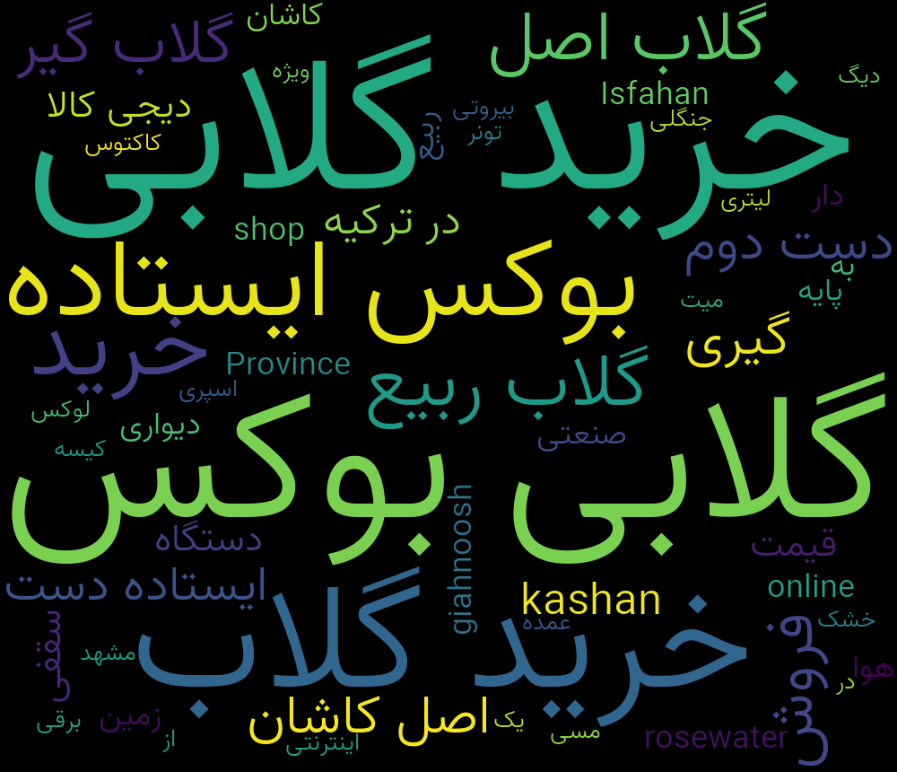
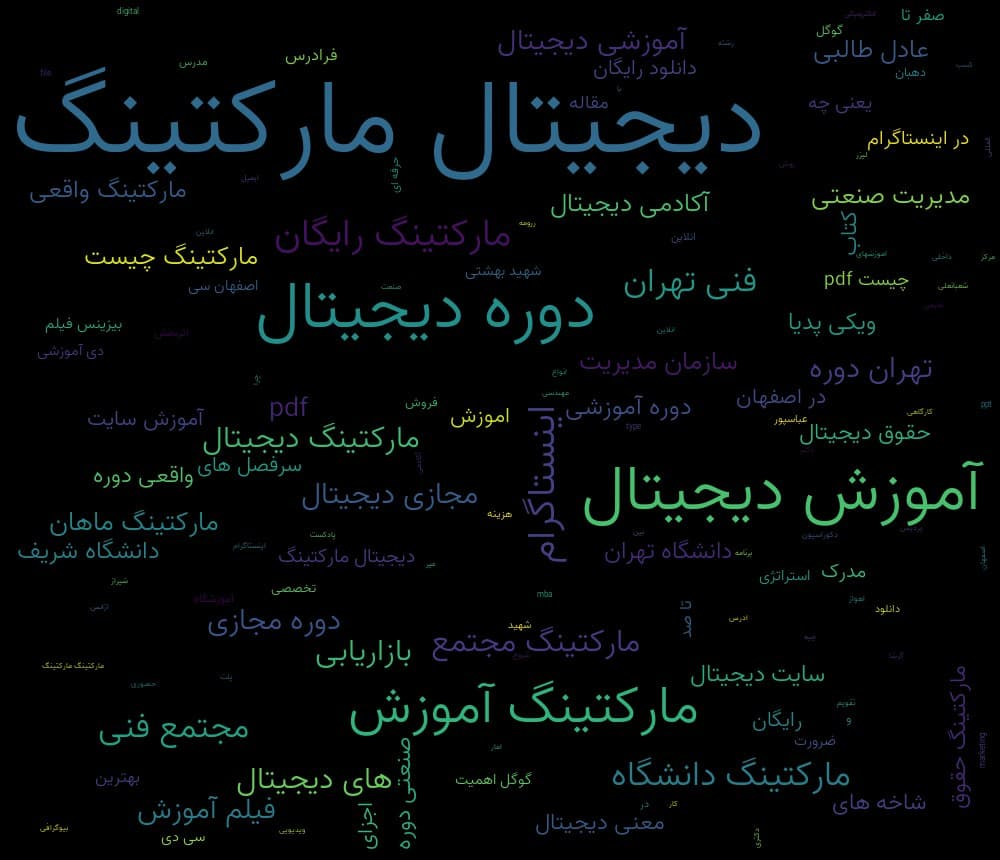
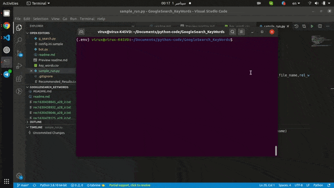

# keyword search by google 

##  هدف 
یکی از کارهایی که افراد در ابتدای تاسیس یک  سایت باید انجام بدن یافتن کلمه کلیدی است که گوگل یکی از مناسب  ترین آن هاست که باتوجه به جستجوهای قبلی کاربران پیشنهادات مشابهی با توجه به کلمه کلیدی میدهد.

در این پروژه سعی شده است تا با استفاده از گوگل کلمات کلیدی جمع آوری و سپس ابر کلمه آن رسم شود و کلمات کلیدی یافت شده داخل فایل های مجزا موجود است .

همچنین برای سهولت کار بات تلگرامی نیز برای این کد نوشته شده است اما در حال حاضر فعال نیست.
این کد جهت سهولت پیدا کردن یافتن کلمات کلیدی از گوگل است که واقعا بیخود و زمان بری هست :)
‍‍‍


# نصب و اجرا

```
# step 1 : create virtualenv
virtualenv -p python3 .env
# step 2 : install packages
pip install -r requirements.txt
# step 3 : run
python codes/sample_run.py  # for change keyword open this file and change it !.


```


برای فعال کردن بات تلگرام ابتدا کار های زیر را انجام دهید

```
# step 1 : create bot tokens on botfather
# step 2 : rename file config.ini.sample to config.ini
# step 3 : replace personal config to file
# step 4 : run file : python bot.py
```


# TODO : 
- [ ] : بهینه سازی و مرتب کردن کدها
- [ ] : پوشه بندی فایل های خروجی 
- [ ] : حذف فایل های زائد
- [ ] : بهبود در جستجو و حذف سرچ های خالی
- [ ] : بهبود بات تلگرام


# نکته 
 گوگل ممکن است در بروز رسانی هایی که انجام میدهد نام کلاس های خود را عوض کند این سبب می شود کد از کار بیافتد که برای رفع آن باید به صفحه  اصلی گوگل مراجعه کنید و کلاس آن را پیدا کنید.

 ## نمونه خروجی

 کلمه کلیدی : خرید گلاب

 

 کلمه کلیدی :‌دیجیتال مارکتینگ 
 
 


 ## نمونه اجرای کد 
  
